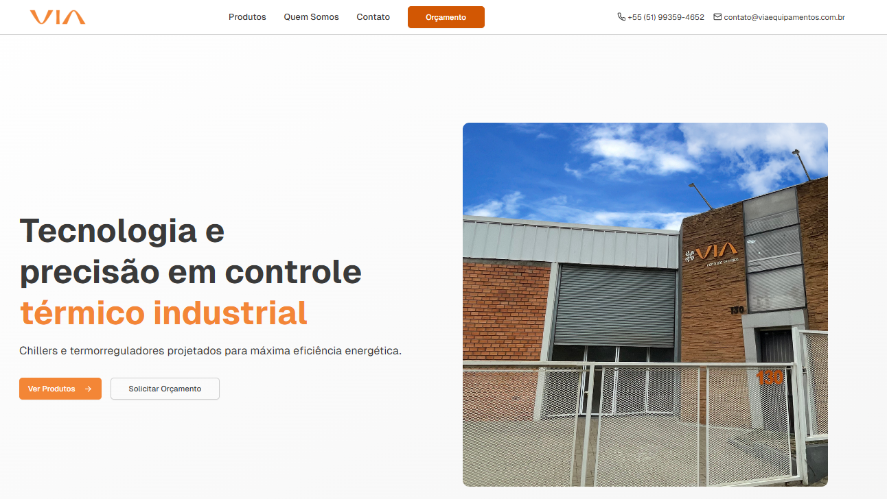
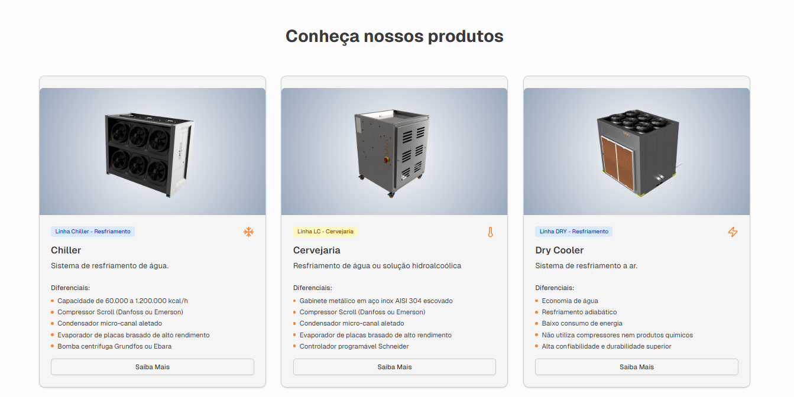
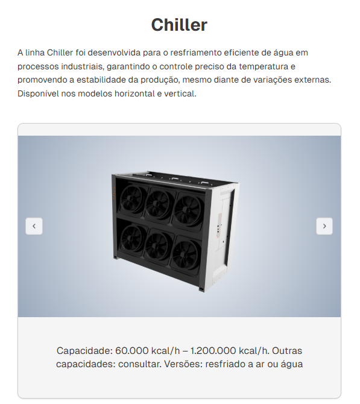
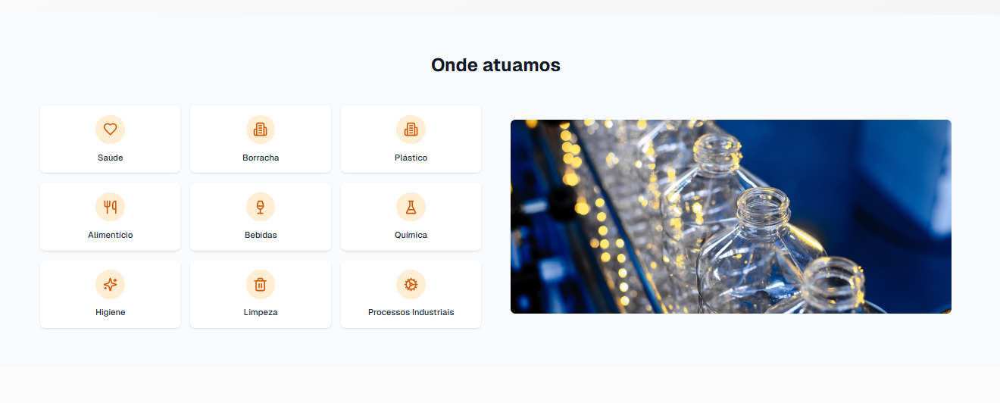

# Via Equipamentos

## 🌐 Sobre o Projeto

Este é o site institucional da **Via Equipamentos**, desenvolvido com foco em:

- 🏢 Apresentação institucional
- 📦 Catálogo de produtos
- 🎯 Geração de leads
- 📞 Captação de contatos comerciais

O projeto foi construído com arquitetura moderna, priorizando performance, escalabilidade e experiência do usuário pela minha agência Boêmia.smk.

## 🌐 Site Oficial
🔗 https://www.viaequipamentos.com.br/

---

## 📸 Preview da Página Inicial

---

## 🏭 Preview Produtos

---

## ❄ Preview Chiller

---

## 🏗 Preview Setores

---

## ⚙️ Tecnologias Utilizadas

- **Next.js** (App Router)
- **TypeScript**
- **Tailwind CSS**
- **Shadcn UI**
- **Vercel** (Deploy)

Arquitetura moderna com foco em:

- Performance
- SEO
- Componentização
- Escalabilidade

---

## 🚀 Como Rodar o Projeto Localmente

### 1️⃣ Clone o repositório
git clone https://github.com/devgabrielsilveira/viaequipamentos.git

### 2️⃣ Acesse a pasta do projeto
cd viaequipamentos

### 3️⃣ Instale as dependências
npm install

### 4️⃣ Rode o projeto
npm run dev

### 4️⃣ Rode o projeto
npm run dev

📬 Contato
Em caso de dúvidas ou sugestões, entre em contato:

Email: devgabrielsilveira@gmail.com  
LinkedIn: https://www.linkedin.com/in/gabriel-silveira-67979b18a/  
<b>Desenvolvido por Boêmia.smk & Gabriel Silveira</b> 🚀
